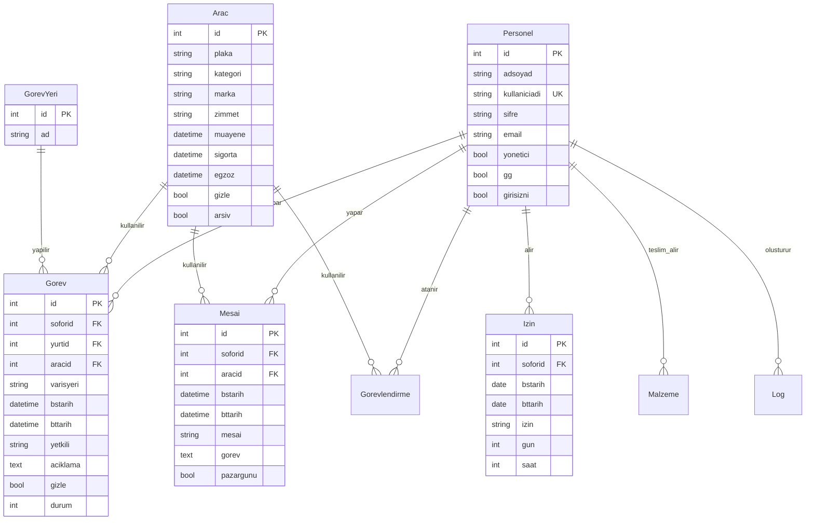

# Tasarım Belgesi

## Genel Bakış

Bu belge, Sakarya GSİM Görev Takip & Yönetim Platformu'nun Django framework kullanılarak yeniden geliştirilmesi için teknik tasarım detaylarını içermektedir. Sistem, mevcut MySQL veritabanından SQLite'a geçiş yapacak, Bootstrap ile modern bir kullanıcı arayüzü sunacak ve tüm operasyonel süreçleri dijital ortamda yönetecektir.

### Teknoloji Stack

- **Backend Framework:** Django 4.2+ (Python 3.10+)
- **Veritabanı:** SQLite 3
- **Frontend:** Bootstrap 5.3, jQuery 3.7
- **Template Engine:** Django Templates
- **Authentication:** Django Auth (Custom User Model)
- **Form Handling:** Django Forms & ModelForms
- **Admin Panel:** Django Admin (özelleştirilmiş)

## Mimari

### Proje Yapısı

```
gorev_takip/
├── manage.py
├── requirements.txt
├── gorev_takip/              # Ana proje klasörü
│   ├── __init__.py
│   ├── settings.py
│   ├── urls.py
│   ├── wsgi.py
│   └── asgi.py
├── core/                     # Ana uygulama modülü
│   ├── __init__.py
│   ├── models.py            # Tüm veri modelleri
│   ├── views.py             # View fonksiyonları
│   ├── forms.py             # Form sınıfları
│   ├── admin.py             # Admin panel özelleştirmeleri
│   ├── urls.py              # URL routing
│   ├── middleware.py        # Custom middleware (log için)
│   ├── utils.py             # Yardımcı fonksiyonlar
│   └── migrations/          # Veritabanı migrasyonları
├── templates/               # HTML şablonları
│   ├── base.html
│   ├── dashboard.html
│   ├── gorev/
│   ├── mesai/
│   ├── izin/
│   ├── arac/
│   ├── personel/
│   └── sistem/
└── static/                  # Statik dosyalar
    ├── css/
    ├── js/
    └── img/
```

### Katmanlı Mimari

1. **Presentation Layer (Sunum Katmanı)**
   - Django Templates + Bootstrap 5
   - Responsive tasarım
   - AJAX ile dinamik içerik yükleme

2. **Business Logic Layer (İş Mantığı Katmanı)**
   - Django Views (Function-based ve Class-based)
   - Form validasyonları
   - İş kuralları ve hesaplamalar

3. **Data Access Layer (Veri Erişim Katmanı)**
   - Django ORM
   - Model sınıfları
   - QuerySet optimizasyonları

4. **Database Layer (Veritabanı Katmanı)**
   - SQLite 3
   - Indexler ve performans optimizasyonları


## Bileşenler ve Arayüzler

### 1. Veri Modelleri (Models)

#### Personel (Sofor) Modeli
```python
class Personel(AbstractBaseUser):
    id = models.AutoField(primary_key=True)
    adsoyad = models.CharField(max_length=255)
    kullaniciadi = models.CharField(max_length=255, unique=True)
    email = models.EmailField()
    yonetici = models.BooleanField(default=False)
    gg = models.BooleanField(default=False)  # Gizli kullanıcı
    girisizni = models.BooleanField(default=False)  # Giriş yasağı
    is_active = models.BooleanField(default=True)
    
    USERNAME_FIELD = 'kullaniciadi'
    
    class Meta:
        db_table = 'sofor'
        verbose_name = 'Personel'
        verbose_name_plural = 'Personeller'
```

#### Araç Modeli
```python
class Arac(models.Model):
    KATEGORI_CHOICES = [
        ('binek', 'Binek'),
        ('minubus', 'Minibüs'),
        ('otobus', 'Otobüs'),
        ('kamyonet', 'Kamyonet'),
        ('kamyon', 'Kamyon'),
    ]
    
    id = models.AutoField(primary_key=True)
    plaka = models.CharField(max_length=100)
    kategori = models.CharField(max_length=20, choices=KATEGORI_CHOICES)
    marka = models.CharField(max_length=100)
    zimmet = models.CharField(max_length=250, blank=True)
    yolcusayisi = models.CharField(max_length=10, blank=True)
    muayene = models.DateTimeField(null=True, blank=True)
    muayanedurum = models.IntegerField(default=0)
    sigorta = models.DateTimeField(null=True, blank=True)
    egzoz = models.DateTimeField(null=True, blank=True)
    gizle = models.BooleanField(default=False)
    takip = models.BooleanField(default=False)
    arsiv = models.BooleanField(default=False)
    
    class Meta:
        db_table = 'arac'
        indexes = [
            models.Index(fields=['plaka']),
            models.Index(fields=['kategori']),
        ]
```

#### Görev Yeri (Yurt) Modeli
```python
class GorevYeri(models.Model):
    id = models.BigAutoField(primary_key=True)
    ad = models.CharField(max_length=255)
    
    class Meta:
        db_table = 'yurt'
        indexes = [models.Index(fields=['ad'])]
```

#### Görev Modeli
```python
class Gorev(models.Model):
    id = models.BigAutoField(primary_key=True)
    sofor = models.ForeignKey(Personel, on_delete=models.CASCADE, db_column='soforid')
    yurt = models.ForeignKey(GorevYeri, on_delete=models.CASCADE, db_column='yurtid')
    varisyeri = models.CharField(max_length=250, default='Düzenlenecek')
    arac = models.ForeignKey(Arac, on_delete=models.SET_NULL, null=True, db_column='aracid')
    bstarih = models.DateTimeField()  # Başlangıç tarihi
    bttarih = models.DateTimeField(null=True, blank=True)  # Bitiş tarihi
    yetkili = models.CharField(max_length=250)
    ilolur = models.CharField(max_length=50, blank=True, null=True)
    aciklama = models.TextField(blank=True, null=True)
    gizle = models.BooleanField(default=False)
    durum = models.IntegerField(null=True, blank=True)
    aktarildi = models.IntegerField(default=0)
    
    class Meta:
        db_table = 'gorev'
        indexes = [
            models.Index(fields=['bstarih']),
            models.Index(fields=['bttarih']),
            models.Index(fields=['durum']),
        ]
```

#### Mesai Modeli
```python
class Mesai(models.Model):
    id = models.AutoField(primary_key=True)
    sofor = models.ForeignKey(Personel, on_delete=models.CASCADE, db_column='soforid')
    bstarih = models.DateTimeField()
    bttarih = models.DateTimeField()
    mesai = models.CharField(max_length=255)  # Mesai süresi (saat)
    arac = models.ForeignKey(Arac, on_delete=models.SET_NULL, null=True, db_column='aracid')
    gorev = models.TextField()
    pazargunu = models.BooleanField(default=False)
    durum = models.IntegerField(null=True, blank=True)
    
    class Meta:
        db_table = 'mesai'
        indexes = [models.Index(fields=['sofor'])]
```

#### İzin Modeli
```python
class Izin(models.Model):
    IZIN_TURLERI = [
        ('1', 'Yıllık İzin'),
        ('2', 'Mazeret İzni'),
        ('3', 'Fazla Mesai İzni'),
        ('4', 'Saatlik İzin'),
    ]
    
    id = models.AutoField(primary_key=True)
    sofor = models.ForeignKey(Personel, on_delete=models.CASCADE, db_column='soforid')
    bstarih = models.DateField()
    bttarih = models.DateField()
    izin = models.CharField(max_length=10, choices=IZIN_TURLERI)
    aciklama = models.TextField(blank=True)
    gun = models.IntegerField(default=0)
    saat = models.IntegerField(default=0)
    
    class Meta:
        db_table = 'izin'
        indexes = [models.Index(fields=['sofor'])]
```


#### Görevlendirme Modeli
```python
class Gorevlendirme(models.Model):
    id = models.AutoField(primary_key=True)
    sofor = models.ForeignKey(Personel, on_delete=models.CASCADE, db_column='soforid')
    bstarih = models.DateTimeField()
    bttarih = models.DateTimeField()
    arac = models.ForeignKey(Arac, on_delete=models.SET_NULL, null=True, db_column='aracid')
    gorev = models.TextField()
    
    class Meta:
        db_table = 'gorevlendirmeler'
```

#### Malzeme Modeli
```python
class Malzeme(models.Model):
    id = models.BigAutoField(primary_key=True)
    sofor = models.ForeignKey(Personel, on_delete=models.CASCADE, db_column='soforid')
    bstarih = models.DateTimeField()
    aciklama = models.TextField()
    
    class Meta:
        db_table = 'malzeme'
```

#### Log Modeli
```python
class Log(models.Model):
    id = models.BigAutoField(primary_key=True)
    sofor = models.ForeignKey(Personel, on_delete=models.CASCADE, db_column='soforid')
    islem = models.TextField()
    tarih = models.DateTimeField(auto_now_add=True)
    ip = models.CharField(max_length=255, null=True, blank=True)
    
    class Meta:
        db_table = 'log'
```

### 2. View Katmanı

#### Dashboard View
- Özet istatistikler (toplam görev, personel, araç sayıları)
- Son eklenen görevler
- Yaklaşan muayene/sigorta uyarıları
- Bugünkü görevler ve mesailer

#### Görev Views
- `gorev_taslak_listesi()` - Taslak görevleri listele
- `gorev_nihai_listesi()` - Tamamlanmış görevleri listele
- `gorev_ekle()` - Yeni görev ekleme formu
- `gorev_duzenle(id)` - Görev düzenleme
- `gorev_sil(id)` - Görev silme (soft delete)
- `gecen_ay_gorevler()` - Geçen ay görevleri
- `eski_gorevler()` - Arşiv görevler

#### Mesai & İzin Views
- `mesai_listesi()` - Tüm mesaileri listele
- `mesai_ekle()` - Mesai ekleme formu
- `personele_mesai_ekle(personel_id)` - Direkt personele mesai ekle
- `izin_listesi()` - Tüm izinleri listele
- `izin_ekle()` - İzin ekleme formu
- `personele_izin_ekle(personel_id)` - Direkt personele izin ekle

#### Araç Views
- `arac_listesi()` - Aktif araçları listele
- `arac_ekle()` - Yeni araç ekleme
- `arac_duzenle(id)` - Araç bilgilerini güncelleme
- `arac_arsiv()` - Arşivlenmiş araçlar
- `arac_muayene_uyarilari()` - Yaklaşan muayene tarihleri

#### Personel Views
- `personel_listesi()` - Tüm personeli listele
- `personel_ekle()` - Yeni personel ekleme
- `personel_duzenle(id)` - Personel bilgilerini güncelleme
- `sifre_degistir()` - Kullanıcı şifre değiştirme

#### Sistem Views
- `log_kayitlari()` - Sistem loglarını görüntüleme
- `sistem_bilgileri()` - Sistem istatistikleri
- `yedek_al()` - Veritabanı yedeği alma

### 3. Form Katmanı

#### GorevForm
```python
class GorevForm(forms.ModelForm):
    class Meta:
        model = Gorev
        fields = ['sofor', 'yurt', 'varisyeri', 'arac', 'bstarih', 
                  'bttarih', 'yetkili', 'ilolur', 'aciklama']
        widgets = {
            'bstarih': forms.DateTimeInput(attrs={'type': 'datetime-local'}),
            'bttarih': forms.DateTimeInput(attrs={'type': 'datetime-local'}),
            'aciklama': forms.Textarea(attrs={'rows': 3}),
        }
```

#### MesaiForm
```python
class MesaiForm(forms.ModelForm):
    class Meta:
        model = Mesai
        fields = ['sofor', 'bstarih', 'bttarih', 'mesai', 'arac', 
                  'gorev', 'pazargunu']
        widgets = {
            'bstarih': forms.DateTimeInput(attrs={'type': 'datetime-local'}),
            'bttarih': forms.DateTimeInput(attrs={'type': 'datetime-local'}),
            'gorev': forms.Textarea(attrs={'rows': 3}),
        }
```

#### AracForm
```python
class AracForm(forms.ModelForm):
    class Meta:
        model = Arac
        fields = ['plaka', 'kategori', 'marka', 'zimmet', 'yolcusayisi',
                  'muayene', 'sigorta', 'egzoz']
        widgets = {
            'muayene': forms.DateInput(attrs={'type': 'date'}),
            'sigorta': forms.DateInput(attrs={'type': 'date'}),
            'egzoz': forms.DateInput(attrs={'type': 'date'}),
        }
```


### 4. URL Routing

```python
# core/urls.py
urlpatterns = [
    # Ana sayfa
    path('', views.dashboard, name='dashboard'),
    
    # Görev yönetimi
    path('gorev/taslak/', views.gorev_taslak_listesi, name='gorev_taslak'),
    path('gorev/nihai/', views.gorev_nihai_listesi, name='gorev_nihai'),
    path('gorev/ekle/', views.gorev_ekle, name='gorev_ekle'),
    path('gorev/duzenle/<int:id>/', views.gorev_duzenle, name='gorev_duzenle'),
    path('gorev/sil/<int:id>/', views.gorev_sil, name='gorev_sil'),
    path('gorev/gecen-ay/', views.gecen_ay_gorevler, name='gecen_ay_gorevler'),
    path('gorev/eski/', views.eski_gorevler, name='eski_gorevler'),
    
    # Mesai & İzin
    path('mesai/', views.mesai_listesi, name='mesai_listesi'),
    path('mesai/ekle/', views.mesai_ekle, name='mesai_ekle'),
    path('mesai/personel/<int:personel_id>/', views.personele_mesai_ekle, name='personele_mesai_ekle'),
    path('izin/', views.izin_listesi, name='izin_listesi'),
    path('izin/ekle/', views.izin_ekle, name='izin_ekle'),
    path('izin/personel/<int:personel_id>/', views.personele_izin_ekle, name='personele_izin_ekle'),
    
    # Görevlendirme
    path('gorevlendirme/', views.gorevlendirme_listesi, name='gorevlendirme_listesi'),
    path('gorevlendirme/ekle/', views.gorevlendirme_ekle, name='gorevlendirme_ekle'),
    
    # Malzeme
    path('malzeme/', views.malzeme_listesi, name='malzeme_listesi'),
    path('malzeme/ekle/', views.malzeme_ekle, name='malzeme_ekle'),
    
    # Görev Yeri
    path('gorev-yeri/', views.gorev_yeri_listesi, name='gorev_yeri_listesi'),
    path('gorev-yeri/ekle/', views.gorev_yeri_ekle, name='gorev_yeri_ekle'),
    
    # Araç
    path('arac/', views.arac_listesi, name='arac_listesi'),
    path('arac/ekle/', views.arac_ekle, name='arac_ekle'),
    path('arac/duzenle/<int:id>/', views.arac_duzenle, name='arac_duzenle'),
    path('arac/arsiv/', views.arac_arsiv, name='arac_arsiv'),
    
    # Personel
    path('personel/', views.personel_listesi, name='personel_listesi'),
    path('personel/ekle/', views.personel_ekle, name='personel_ekle'),
    path('personel/duzenle/<int:id>/', views.personel_duzenle, name='personel_duzenle'),
    path('sifre-degistir/', views.sifre_degistir, name='sifre_degistir'),
    
    # Sistem
    path('log/', views.log_kayitlari, name='log_kayitlari'),
    path('sistem-bilgileri/', views.sistem_bilgileri, name='sistem_bilgileri'),
    path('yedek/', views.yedek_al, name='yedek_al'),
    
    # Auth
    path('giris/', views.giris, name='giris'),
    path('cikis/', views.cikis, name='cikis'),
]
```

### 5. Middleware ve Yardımcı Fonksiyonlar

#### LogMiddleware
```python
class LogMiddleware:
    """Her önemli işlemi otomatik log kaydına alan middleware"""
    
    def __init__(self, get_response):
        self.get_response = get_response
    
    def __call__(self, request):
        response = self.get_response(request)
        
        # POST işlemlerini logla
        if request.method == 'POST' and request.user.is_authenticated:
            self.log_action(request)
        
        return response
    
    def log_action(self, request):
        # Log kaydı oluştur
        pass
```

#### Yardımcı Fonksiyonlar (utils.py)
```python
def get_client_ip(request):
    """İstemci IP adresini al"""
    x_forwarded_for = request.META.get('HTTP_X_FORWARDED_FOR')
    if x_forwarded_for:
        ip = x_forwarded_for.split(',')[0]
    else:
        ip = request.META.get('REMOTE_ADDR')
    return ip

def hesapla_mesai_suresi(baslangic, bitis):
    """Mesai süresini saat olarak hesapla"""
    delta = bitis - baslangic
    return delta.total_seconds() / 3600

def kontrol_muayene_tarihi(arac):
    """Araç muayene tarihini kontrol et ve uyarı döndür"""
    from datetime import datetime, timedelta
    if arac.muayene:
        kalan_gun = (arac.muayene.date() - datetime.now().date()).days
        if kalan_gun < 30:
            return f"Muayene tarihi yaklaşıyor! ({kalan_gun} gün kaldı)"
    return None
```


## Veri Modelleri Detayları

### İlişkiler ve Foreign Keys



### Veri Doğrulama Kuralları

#### Görev Validasyonu
- Başlangıç tarihi bitiş tarihinden önce olmalı
- Personel ve görev yeri seçimi zorunlu
- Araç seçimi opsiyonel (bazı görevler araç gerektirmez)
- Yetkili adı boş bırakılamaz

#### Mesai Validasyonu
- Başlangıç ve bitiş tarihleri zorunlu
- Mesai süresi otomatik hesaplanmalı
- Negatif mesai süresi olamaz
- Pazar günü mesaisi işaretlenebilir

#### İzin Validasyonu
- Başlangıç tarihi bitiş tarihinden önce veya eşit olmalı
- Gün veya saat bilgisi girilmeli
- İzin türü seçimi zorunlu
- Personelin kalan izin hakkı kontrol edilmeli

#### Araç Validasyonu
- Plaka formatı kontrol edilmeli (Türkiye plaka formatı)
- Muayene, sigorta, egzoz tarihleri geçmiş tarih olamaz
- Kategori seçimi zorunlu
- Yolcu sayısı sayısal olmalı

## Hata Yönetimi

### Hata Türleri ve Çözümleri

1. **Veri Bütünlüğü Hataları**
   - Foreign key ihlalleri: Cascade delete veya SET_NULL kullanımı
   - Unique constraint ihlalleri: Kullanıcıya anlaşılır hata mesajı

2. **Validasyon Hataları**
   - Form validasyonları: Django Forms ile otomatik kontrol
   - Custom validasyonlar: clean() metodları ile

3. **Yetkilendirme Hataları**
   - Yetkisiz erişim: @login_required decorator
   - Yönetici kontrolü: Custom decorator (@admin_required)

4. **Veritabanı Hataları**
   - Connection errors: Try-except blokları
   - Transaction rollback: Django transaction.atomic()

### Hata Loglama

```python
import logging

logger = logging.getLogger(__name__)

def gorev_ekle(request):
    try:
        # İşlem kodu
        pass
    except Exception as e:
        logger.error(f"Görev ekleme hatası: {str(e)}", exc_info=True)
        messages.error(request, "Görev eklenirken bir hata oluştu.")
        return redirect('gorev_taslak')
```


## Test Stratejisi

### 1. Unit Tests (Birim Testleri)

#### Model Testleri
```python
class PersonelModelTest(TestCase):
    def test_personel_olusturma(self):
        personel = Personel.objects.create(
            adsoyad="Test Kullanıcı",
            kullaniciadi="test",
            email="test@test.com"
        )
        self.assertEqual(personel.adsoyad, "Test Kullanıcı")
    
    def test_personel_str_metodu(self):
        personel = Personel.objects.create(
            adsoyad="Test Kullanıcı",
            kullaniciadi="test"
        )
        self.assertEqual(str(personel), "Test Kullanıcı")
```

#### Form Testleri
```python
class GorevFormTest(TestCase):
    def test_gecerli_form(self):
        form_data = {
            'sofor': 1,
            'yurt': 1,
            'varisyeri': 'Test Yeri',
            'bstarih': '2025-01-01 10:00',
            'yetkili': 'Test Yetkili'
        }
        form = GorevForm(data=form_data)
        self.assertTrue(form.is_valid())
    
    def test_gecersiz_tarih(self):
        form_data = {
            'bstarih': '2025-01-01 10:00',
            'bttarih': '2024-12-31 10:00'  # Bitiş başlangıçtan önce
        }
        form = GorevForm(data=form_data)
        self.assertFalse(form.is_valid())
```

#### View Testleri
```python
class GorevViewTest(TestCase):
    def setUp(self):
        self.user = Personel.objects.create_user(
            kullaniciadi='test',
            password='test123'
        )
        self.client.login(kullaniciadi='test', password='test123')
    
    def test_gorev_listesi_view(self):
        response = self.client.get(reverse('gorev_taslak'))
        self.assertEqual(response.status_code, 200)
        self.assertTemplateUsed(response, 'gorev/taslak.html')
    
    def test_gorev_ekle_post(self):
        response = self.client.post(reverse('gorev_ekle'), {
            'sofor': self.user.id,
            'yurt': 1,
            'varisyeri': 'Test',
            'bstarih': '2025-01-01 10:00',
            'yetkili': 'Test'
        })
        self.assertEqual(Gorev.objects.count(), 1)
```

### 2. Integration Tests (Entegrasyon Testleri)

- Görev ekleme ve listeleme akışı
- Mesai ekleme ve hesaplama
- İzin ekleme ve kalan izin güncelleme
- Araç muayene uyarı sistemi
- Log kaydı oluşturma

### 3. Functional Tests (Fonksiyonel Testler)

- Kullanıcı giriş/çıkış akışı
- Yönetici ve standart kullanıcı yetkilendirme
- Form validasyonları
- AJAX işlemleri
- Filtreleme ve arama fonksiyonları

### 4. Performance Tests (Performans Testleri)

- Büyük veri setleri ile liste görüntüleme
- Pagination performansı
- Database query optimizasyonu
- N+1 query problemlerinin tespiti

### Test Coverage Hedefi

- Model testleri: %90+
- View testleri: %80+
- Form testleri: %85+
- Genel coverage: %80+

## Güvenlik Önlemleri

### 1. Authentication & Authorization

```python
# Custom decorator for admin check
def admin_required(view_func):
    @wraps(view_func)
    def wrapper(request, *args, **kwargs):
        if not request.user.is_authenticated:
            return redirect('giris')
        if not request.user.yonetici:
            messages.error(request, "Bu sayfaya erişim yetkiniz yok.")
            return redirect('dashboard')
        return view_func(request, *args, **kwargs)
    return wrapper
```

### 2. CSRF Protection

- Tüm POST formlarında `` kullanımı
- AJAX isteklerinde CSRF token gönderimi

### 3. SQL Injection Prevention

- Django ORM kullanımı (raw SQL yerine)
- Parametreli sorgular

### 4. XSS Prevention

- Template'lerde otomatik escaping
- `|safe` filter'ı dikkatli kullanım
- User input sanitization

### 5. Password Security

```python
# MD5 hash'i Django ile uyumlu hale getirme
from django.contrib.auth.hashers import BasePasswordHasher
from hashlib import md5

class MD5PasswordHasher(BasePasswordHasher):
    algorithm = "md5"
    
    def encode(self, password, salt):
        hash = md5(password.encode()).hexdigest()
        return f"md5${salt}${hash}"
    
    def verify(self, password, encoded):
        algorithm, salt, hash = encoded.split('$', 2)
        encoded_2 = self.encode(password, salt)
        return encoded == encoded_2
```

### 6. Session Security

```python
# settings.py
SESSION_COOKIE_HTTPONLY = True
SESSION_COOKIE_SECURE = True  # Production için
SESSION_COOKIE_AGE = 3600  # 1 saat
```


## Veri Migrasyonu Stratejisi

### Migrasyon Adımları

1. **SQL Dosyasını Parse Etme**
   - SQL dosyasını okuma
   - INSERT statement'larını ayıklama
   - Veri tiplerini dönüştürme

2. **Django Modellerine Aktarma**
   ```python
   # migrate_data.py
   import re
   from datetime import datetime
   from core.models import Personel, Arac, GorevYeri, Gorev, Mesai, Izin
   
   def parse_sql_file(filename):
       with open(filename, 'r', encoding='utf-8') as f:
           content = f.read()
       return content
   
   def migrate_personel(sql_content):
       # sofor tablosunu migrate et
       pattern = r"INSERT INTO sofor.*?VALUES \((.*?)\);"
       matches = re.findall(pattern, sql_content)
       
       for match in matches:
           # Veriyi parse et ve Personel modeline kaydet
           pass
   
   def migrate_arac(sql_content):
       # arac tablosunu migrate et
       pass
   
   def migrate_gorev(sql_content):
       # gorev tablosunu migrate et
       pass
   ```

3. **Tarih Dönüşümleri**
   ```python
   def convert_date(date_str):
       """MySQL datetime'ı Python datetime'a çevir"""
       if date_str == '1970-01-01 00:00:00':
           return None
       try:
           return datetime.strptime(date_str, '%Y-%m-%d %H:%M:%S')
       except:
           return None
   ```

4. **Veri Bütünlüğü Kontrolleri**
   ```python
   def verify_migration():
       """Migrasyon sonrası veri kontrolü"""
       print(f"Personel sayısı: {Personel.objects.count()}")
       print(f"Araç sayısı: {Arac.objects.count()}")
       print(f"Görev sayısı: {Gorev.objects.count()}")
       print(f"Mesai sayısı: {Mesai.objects.count()}")
       print(f"İzin sayısı: {Izin.objects.count()}")
   ```

### Migrasyon Script Örneği

```python
# management/commands/migrate_from_mysql.py
from django.core.management.base import BaseCommand
from core.models import *
import re
from datetime import datetime

class Command(BaseCommand):
    help = 'MySQL veritabanından SQLite\'a veri migrasyonu'
    
    def add_arguments(self, parser):
        parser.add_argument('sql_file', type=str, help='SQL dump dosyası')
    
    def handle(self, *args, **options):
        sql_file = options['sql_file']
        
        self.stdout.write('Migrasyon başlıyor...')
        
        # Personel migrasyonu
        self.migrate_personel(sql_file)
        self.stdout.write(self.style.SUCCESS('Personel migrasyonu tamamlandı'))
        
        # Araç migrasyonu
        self.migrate_arac(sql_file)
        self.stdout.write(self.style.SUCCESS('Araç migrasyonu tamamlandı'))
        
        # Görev Yeri migrasyonu
        self.migrate_gorev_yeri(sql_file)
        self.stdout.write(self.style.SUCCESS('Görev Yeri migrasyonu tamamlandı'))
        
        # Görev migrasyonu
        self.migrate_gorev(sql_file)
        self.stdout.write(self.style.SUCCESS('Görev migrasyonu tamamlandı'))
        
        # Mesai migrasyonu
        self.migrate_mesai(sql_file)
        self.stdout.write(self.style.SUCCESS('Mesai migrasyonu tamamlandı'))
        
        # İzin migrasyonu
        self.migrate_izin(sql_file)
        self.stdout.write(self.style.SUCCESS('İzin migrasyonu tamamlandı'))
        
        # Görevlendirme migrasyonu
        self.migrate_gorevlendirme(sql_file)
        self.stdout.write(self.style.SUCCESS('Görevlendirme migrasyonu tamamlandı'))
        
        # Log migrasyonu
        self.migrate_log(sql_file)
        self.stdout.write(self.style.SUCCESS('Log migrasyonu tamamlandı'))
        
        self.stdout.write(self.style.SUCCESS('Tüm migrasyon tamamlandı!'))
```

## Frontend Tasarımı

### Template Yapısı

#### base.html
```html
<!DOCTYPE html>
<html lang="tr">
<head>
    <meta charset="UTF-8">
    <meta name="viewport" content="width=device-width, initial-scale=1.0">
    <title>Görev Takip Sistemi</title>
    <link href="https://cdn.jsdelivr.net/npm/bootstrap@5.3.0/dist/css/bootstrap.min.css" rel="stylesheet">
    <link rel="stylesheet" href="">
    
</head>
<body>
    
    
    <div class="container-fluid">
        <div class="row">
            
            
            <main class="col-md-9 ms-sm-auto col-lg-10 px-md-4">
                
                    
                        <div class="alert alert-{{ message.tags }} alert-dismissible fade show" role="alert">
                            {{ message }}
                            <button type="button" class="btn-close" data-bs-dismiss="alert"></button>
                        </div>
                    
                
                
                
            </main>
        </div>
    </div>
    
    <script src="https://cdn.jsdelivr.net/npm/bootstrap@5.3.0/dist/js/bootstrap.bundle.min.js"></script>
    <script src="https://code.jquery.com/jquery-3.7.0.min.js"></script>
    
</body>
</html>
```

#### Sidebar Menü
```html
<!-- partials/sidebar.html -->
<nav class="col-md-3 col-lg-2 d-md-block bg-light sidebar">
    <div class="position-sticky pt-3">
        <ul class="nav flex-column">
            <li class="nav-item">
                <a class="nav-link" href="">
                    <i class="bi bi-house"></i> Anasayfa
                </a>
            </li>
            
            <li class="nav-item">
                <a class="nav-link" data-bs-toggle="collapse" href="#gorevMenu">
                    <i class="bi bi-clipboard"></i> Görev
                </a>
                <div class="collapse" id="gorevMenu">
                    <ul class="nav flex-column ms-3">
                        <li><a class="nav-link" href="">Görev Taslağı</a></li>
                        <li><a class="nav-link" href="">Nihai Liste</a></li>
                        <li><a class="nav-link" href="">Yeni Görev Ekle</a></li>
                    </ul>
                </div>
            </li>
            
            <!-- Diğer menü öğeleri -->
        </ul>
    </div>
</nav>
```

### Bootstrap Bileşenleri

1. **Tablolar**: DataTables ile gelişmiş tablo özellikleri
2. **Formlar**: Bootstrap form validation
3. **Modals**: Silme onayları için
4. **Alerts**: Başarı/hata mesajları
5. **Cards**: Dashboard widget'ları
6. **Badges**: Durum göstergeleri

### Responsive Tasarım

- Mobile-first yaklaşım
- Breakpoint'ler: xs, sm, md, lg, xl
- Sidebar collapse on mobile
- Touch-friendly buttons


## Performans Optimizasyonları

### 1. Database Query Optimizasyonu

```python
# N+1 problem çözümü - select_related ve prefetch_related kullanımı
def gorev_listesi(request):
    gorevler = Gorev.objects.select_related(
        'sofor', 'yurt', 'arac'
    ).filter(gizle=False).order_by('-bstarih')
    
    return render(request, 'gorev/liste.html', {'gorevler': gorevler})

# Aggregate ve annotate kullanımı
from django.db.models import Count, Sum
gorev_yerleri = GorevYeri.objects.annotate(
    gorev_sayisi=Count('gorev')
).order_by('-gorev_sayisi')
```

### 2. Caching Stratejisi

```python
# settings.py
CACHES = {
    'default': {
        'BACKEND': 'django.core.cache.backends.locmem.LocMemCache',
        'LOCATION': 'unique-snowflake',
    }
}

# View'larda cache kullanımı
from django.views.decorators.cache import cache_page

@cache_page(60 * 15)  # 15 dakika cache
def dashboard(request):
    # Dashboard verileri
    pass
```

### 3. Pagination

```python
from django.core.paginator import Paginator

def gorev_listesi(request):
    gorevler = Gorev.objects.all().order_by('-bstarih')
    paginator = Paginator(gorevler, 25)  # Sayfa başına 25 kayıt
    
    page_number = request.GET.get('page')
    page_obj = paginator.get_page(page_number)
    
    return render(request, 'gorev/liste.html', {'page_obj': page_obj})
```

### 4. Static Files Optimization

```python
# settings.py
STATICFILES_STORAGE = 'django.contrib.staticfiles.storage.ManifestStaticFilesStorage'

# Template'de

<link rel="stylesheet" href="">
```

### 5. Database Indexing

```python
class Gorev(models.Model):
    # ...
    class Meta:
        indexes = [
            models.Index(fields=['bstarih', 'durum']),
            models.Index(fields=['sofor', 'bstarih']),
            models.Index(fields=['-bstarih']),  # Descending index
        ]
```

## Deployment Stratejisi

### 1. Production Settings

```python
# settings_production.py
DEBUG = False
ALLOWED_HOSTS = ['gorev.webfirmam.com', 'www.gorev.webfirmam.com']

# Security settings
SECURE_SSL_REDIRECT = True
SESSION_COOKIE_SECURE = True
CSRF_COOKIE_SECURE = True
SECURE_BROWSER_XSS_FILTER = True
SECURE_CONTENT_TYPE_NOSNIFF = True
X_FRAME_OPTIONS = 'DENY'

# Database
DATABASES = {
    'default': {
        'ENGINE': 'django.db.backends.sqlite3',
        'NAME': BASE_DIR / 'db.sqlite3',
    }
}

# Static files
STATIC_ROOT = BASE_DIR / 'staticfiles'
STATIC_URL = '/static/'
```

### 2. WSGI/ASGI Configuration

```python
# wsgi.py
import os
from django.core.wsgi import get_wsgi_application

os.environ.setdefault('DJANGO_SETTINGS_MODULE', 'gorev_takip.settings_production')
application = get_wsgi_application()
```

### 3. Web Server Configuration (Nginx)

```nginx
server {
    listen 80;
    server_name gorev.webfirmam.com;
    
    location /static/ {
        alias /path/to/staticfiles/;
    }
    
    location /media/ {
        alias /path/to/media/;
    }
    
    location / {
        proxy_pass http://127.0.0.1:8000;
        proxy_set_header Host $host;
        proxy_set_header X-Real-IP $remote_addr;
        proxy_set_header X-Forwarded-For $proxy_add_x_forwarded_for;
    }
}
```

### 4. Systemd Service

```ini
[Unit]
Description=Gorev Takip Django Application
After=network.target

[Service]
User=www-data
Group=www-data
WorkingDirectory=/path/to/gorev_takip
ExecStart=/path/to/venv/bin/gunicorn --workers 3 --bind 127.0.0.1:8000 gorev_takip.wsgi:application

[Install]
WantedBy=multi-user.target
```

## Bakım ve İzleme

### 1. Logging Configuration

```python
# settings.py
LOGGING = {
    'version': 1,
    'disable_existing_loggers': False,
    'formatters': {
        'verbose': {
            'format': '{levelname} {asctime} {module} {message}',
            'style': '{',
        },
    },
    'handlers': {
        'file': {
            'level': 'ERROR',
            'class': 'logging.FileHandler',
            'filename': 'logs/django_errors.log',
            'formatter': 'verbose',
        },
        'console': {
            'level': 'INFO',
            'class': 'logging.StreamHandler',
            'formatter': 'verbose',
        },
    },
    'loggers': {
        'django': {
            'handlers': ['file', 'console'],
            'level': 'INFO',
            'propagate': True,
        },
        'core': {
            'handlers': ['file', 'console'],
            'level': 'DEBUG',
            'propagate': False,
        },
    },
}
```

### 2. Backup Strategy

```python
# management/commands/backup_db.py
from django.core.management.base import BaseCommand
import shutil
from datetime import datetime
from django.conf import settings

class Command(BaseCommand):
    help = 'Veritabanı yedeği al'
    
    def handle(self, *args, **options):
        db_path = settings.DATABASES['default']['NAME']
        backup_name = f"backup_{datetime.now().strftime('%Y%m%d_%H%M%S')}.sqlite3"
        backup_path = settings.BASE_DIR / 'backups' / backup_name
        
        shutil.copy2(db_path, backup_path)
        self.stdout.write(self.style.SUCCESS(f'Yedek alındı: {backup_name}'))
```

### 3. Monitoring

- Django Debug Toolbar (development)
- Sentry (error tracking)
- Custom dashboard için sistem metrikleri

## Sonuç

Bu tasarım belgesi, Sakarya GSİM Görev Takip Sistemi'nin Django ile yeniden geliştirilmesi için kapsamlı bir teknik plan sunmaktadır. Tüm modüller, veri modelleri, güvenlik önlemleri, test stratejileri ve deployment adımları detaylandırılmıştır. Sistem, mevcut MySQL veritabanından SQLite'a sorunsuz geçiş yapacak ve modern, güvenli, performanslı bir web uygulaması olarak hizmet verecektir.
